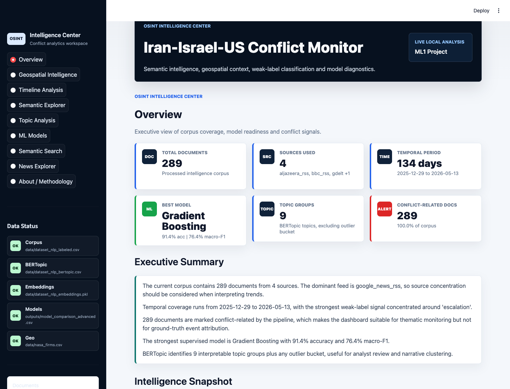

# OSINT Intelligence Center


Professional Data Science and NLP project for OSINT-style analysis of the Iran-Israel-US conflict narrative. The project combines news collection, weak supervision, classic NLP, semantic embeddings, BERTopic, supervised ML, geospatial context and a Streamlit intelligence dashboard.

## Executive Summary

This repository delivers an end-to-end academic OSINT platform. It turns a multilingual geopolitical monitoring problem into a reproducible NLP workflow focused on English news and contextual geospatial signals. The final dashboard is designed as an **OSINT Intelligence Center** with executive KPIs, timeline analysis, semantic search, BERTopic topics, model diagnostics, geospatial overlays and a filterable news explorer.

The platform is intended for university evaluation and presentation. It is not a production intelligence product and does not claim ground-truth event attribution.

## Quick Start: Run In Less Than 3 Minutes

```bash
cd Proyecto_final_ml
python3 -m venv .venv
source .venv/bin/activate
pip install -r requirements.txt
streamlit run app.py
```

Open:

```text
http://localhost:8501
```

Alternative one-command launcher:

```bash
chmod +x run_project.sh
./run_project.sh
```

## Project Architecture

```text
Proyecto_final_ml/
├── app.py                         # Final Streamlit OSINT dashboard
├── README.md                      # Delivery-ready documentation
├── requirements.txt               # Python dependencies
├── .env.example                   # Environment template
├── run_project.sh                 # Local launcher and validator
│
├── data/                          # Corpus and raw/context datasets
├── notebooks/                     # Academic notebooks
├── scripts/                       # Reproducible NLP/ML pipeline scripts
├── outputs/                       # Metrics, figures, models and artifacts
├── report/                        # Final written report
├── dashboard/assets/              # Dashboard CSS
├── assets/                        # Release/static assets
├── docs/                          # Academic and technical notes
├── screenshots/                   # Dashboard screenshots
├── deployment/                    # Deployment documentation
└── release/                       # Generated delivery package
```

## Dashboard Screenshots

Screenshots are generated in `screenshots/`:



| View | File |
|---|---|
| Overview | `screenshots/dashboard_overview.png` |
| Semantic Search | `screenshots/semantic_search.png` |
| Geospatial Map | `screenshots/geospatial_map.png` |
| ML Models | `screenshots/ml_models.png` |
| Topic Analysis | `screenshots/topic_analysis.png` |

## Dashboard Modules

1. **Overview**: document count, sources, time coverage, best model, topic count, conflict-related count and automatic executive summary.
2. **Geospatial Intelligence**: Plotly map with NASA FIRMS hotspots and OpenSky aircraft points, source/date filters, tooltips and optional heatmap.
3. **Timeline Analysis**: daily or weekly activity, source and weak-label filters, and spike detection.
4. **Semantic Explorer**: interactive UMAP projection of semantic embeddings.
5. **Topic Analysis**: BERTopic topics, top words, document distribution and embedded BERTopic HTML.
6. **ML Models**: model leaderboard, accuracy/macro-F1 comparison and confusion matrices.
7. **Semantic Search**: FAISS semantic search with local TF-IDF fallback if the sentence-transformer model is unavailable.
8. **News Explorer**: filterable document table with clickable URLs.
9. **About / Methodology**: sources, pipeline, weak labels, limitations and academic context.

## Methodology

### OSINT Objective

The project explores how open-source news and contextual datasets can support analytical monitoring of geopolitical conflict narratives. The goal is not prediction of real-world escalation, but structured exploration of public information signals.

### Classic NLP

Classic NLP steps include cleaning, tokenization, stopword removal, TF-IDF vectorization, clustering and supervised classification. These techniques provide interpretable baselines and support reproducible model comparison.

### Modern NLP

Modern NLP is represented through sentence-transformer embeddings, UMAP visualization and FAISS similarity search. These methods enable semantic neighborhood exploration beyond exact keyword matching.

### Weak Labels

Labels such as `escalation`, `military`, `diplomacy`, `energy`, `humanitarian`, `sanctions`, `cyber` and `other` are generated heuristically. They are useful for supervised experiments, but they are not human-validated ground truth.

### BERTopic

BERTopic is used to discover interpretable document themes through transformer embeddings and class-based TF-IDF topic representations. The dashboard exposes topic words, distributions and an interactive topic visualization when available.

### Geopolitical Correlation

NASA FIRMS and OpenSky are included as geospatial context layers. They can help analysts compare temporal and spatial signals, but they are separate from the text corpus and must not be interpreted as proof of causal relationships.

## Results Snapshot

- Corpus: 289 processed documents.
- Sources: Google News RSS, GDELT, Al Jazeera RSS and BBC RSS.
- Weak-label categories: escalation, military, diplomacy, other, energy, humanitarian, sanctions and cyber.
- Semantic representation: sentence-transformer embeddings with UMAP projection.
- Topic modeling: BERTopic output with top words and document distribution.
- Best advanced model output: Gradient Boosting / GradientBoosting with approximately 91% accuracy in the current comparison file.
- Search: FAISS semantic index plus TF-IDF fallback.

## Installation

```bash
python3 -m venv .venv
source .venv/bin/activate
python -m pip install --upgrade pip
pip install -r requirements.txt
```

## Run The Dashboard

```bash
streamlit run app.py
```

Useful local URLs:

```text
http://localhost:8501
http://127.0.0.1:8501
```

## Regenerate Pipeline Outputs

```bash
python scripts/prepare_dataset_nlp.py
python scripts/nlp_analysis.py
python scripts/supervised_ml.py
python scripts/semantic_embeddings.py
python scripts/bertopic_analysis.py
python scripts/semantic_search.py
python scripts/advanced_ml.py
```

The dashboard handles missing files gracefully, but the full experience requires `data/`, `outputs/models/` and `outputs/advanced_figures/`.

## GitHub Setup

```bash
git init
git add app.py README.md requirements.txt .env.example data notebooks scripts outputs report dashboard assets docs deployment screenshots run_project.sh
git commit -m "Final OSINT Intelligence Center release"
git branch -M main
git remote add origin <YOUR_GITHUB_REPOSITORY_URL>
git push -u origin main
```

Do not commit `.env`, `.venv`, `.DS_Store`, caches or temporary release ZIPs unless your instructor explicitly requests them.

## Streamlit Cloud Deployment

1. Push this project to GitHub.
2. In Streamlit Community Cloud, create a new app from the repository.
3. Set the main file path to `app.py`.
4. Ensure `requirements.txt` is present.
5. Deploy and wait for dependency installation.

Detailed deployment notes are in `deployment/streamlit_cloud.md`.

## Limitations

- Weak labels are heuristic and not expert-validated.
- The corpus is small and source distribution is imbalanced.
- Google News RSS dominates the current dataset.
- Geospatial context does not prove event causality.
- The dashboard supports academic exploration, not operational intelligence decisions.
- Some semantic models may require internet access on first download; local TF-IDF fallback keeps search usable offline.

## Future Work

- Human validation of weak labels.
- Larger multilingual corpus.
- Source reliability scoring.
- Event extraction and entity linking.
- Time-aware topic drift analysis.
- Better geospatial normalization and conflict-event matching.
- Automated CI checks for dashboard startup and data integrity.

## Delivery Package

The final ZIP is generated as:

```text
Proyecto_final_ml_release.zip
```

It contains:

```text
release/Proyecto_final_ml_release/
```

Excluded from the ZIP:

- `.git/`
- `.venv/`
- `__pycache__/`
- `.DS_Store`
- Jupyter checkpoints
- temporary caches
- generated release ZIPs

## Academic Note

This project demonstrates the difference between classic NLP methods and modern semantic representations in an OSINT scenario. Classic methods provide transparent baselines, while embeddings and BERTopic improve semantic exploration. The weak-label strategy makes supervised experimentation possible, but methodological caution is necessary because labels are approximate and not expert-reviewed.
