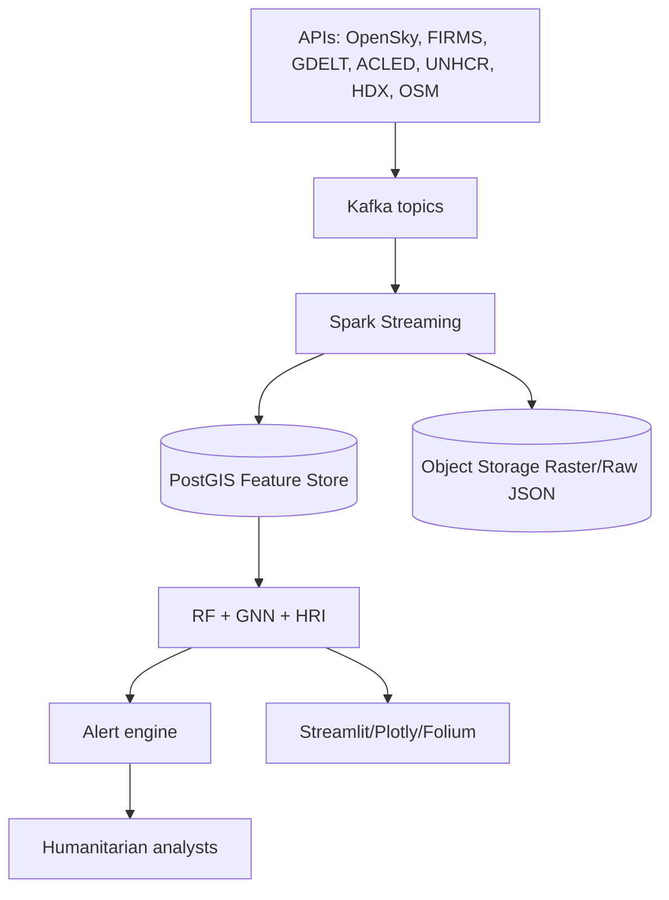

# Sistema inteligente de prediccion de riesgo humanitario y desplazamiento poblacional mediante Machine Learning, GeoAI y datos OSINT en contextos de conflicto armado

## Resumen

Este proyecto propone un sistema de Humanitarian AI y GeoAI para estimar, monitorear y predecir riesgo humanitario regional asociado a conflictos armados en Iran y Medio Oriente. El enfoque integra datos abiertos satelitales, trafico aereo ADS-B, eventos de conflicto, noticias geolocalizadas, indicadores de desplazamiento, densidad poblacional, infraestructura critica y redes de accesibilidad. La arquitectura combina APIs abiertas, procesamiento geoespacial, NLP geopolitico, indices dinamicos de riesgo, modelos supervisados, redes espaciales y Graph Neural Networks.

El sistema no busca inferir objetivos militares ni apoyar operaciones ofensivas. Su finalidad es humanitaria: alerta temprana, proteccion civil, priorizacion de ayuda, monitoreo de desplazamiento, analisis de accesibilidad y apoyo a decisiones estrategicas de organizaciones internacionales, agencias de Naciones Unidas, ONG y equipos de respuesta a crisis.

## 1. Contexto del problema

Los conflictos armados contemporaneos generan crisis humanitarias complejas porque combinan violencia directa, deterioro institucional, interrupcion logistica, dano a infraestructura critica, movilidad forzada, inseguridad alimentaria, presion sobre sistemas de salud y degradacion de servicios basicos. En regiones con alta densidad urbana, dependencia de corredores logisticos y redes energeticas interconectadas, un evento localizado puede producir efectos en cascada sobre poblaciones civiles distantes.

Iran y Medio Oriente representan un entorno de riesgo regional particularmente sensible. La region concentra corredores maritimos y aereos estrategicos, infraestructura energetica, ciudades densas, fronteras politicamente fragiles, actores estatales y no estatales, y poblaciones desplazadas por crisis acumuladas. Una escalada armada puede afectar rutas aereas, puertos, hospitales, carreteras, campamentos, zonas fronterizas y cadenas de suministro humanitario.

Las crisis humanitarias no aparecen de forma aislada. Suelen estar precedidas por senales observables:

- Incremento de eventos de violencia politica en ACLED.
- Aumento de menciones mediaticas y narrativa de escalamiento en GDELT y RSS.
- Hotspots termicos detectados por NASA FIRMS.
- Cambios en movilidad aerea observables en OpenSky.
- Degradacion de accesibilidad en redes viales de OpenStreetMap.
- Concentracion de poblacion expuesta segun WorldPop.
- Incrementos o redistribuciones en datos UNHCR de desplazamiento.
- Aparicion de datasets humanitarios relevantes en HDX.
- Cambios satelitales capturados por Sentinel Hub o Google Earth Engine.

La inteligencia geoespacial y la Humanitarian AI transforman el monitoreo de crisis al permitir integrar observaciones heterogeneas, convertir datos abiertos en indicadores comparables y producir mapas de riesgo actualizables. En lugar de depender solo de reportes manuales, un sistema multimodal puede detectar patrones tempranos, priorizar zonas vulnerables y explicar que factores estan elevando el riesgo.

## 2. Justificacion

El proyecto es importante porque las organizaciones humanitarias necesitan anticiparse a crisis civiles en contextos de alta incertidumbre. La disponibilidad de datos abiertos no garantiza utilidad operacional: los datos estan dispersos, poseen resoluciones espaciales y temporales distintas, contienen sesgos de cobertura y requieren integracion tecnica rigurosa.

Un sistema de prediccion de riesgo humanitario puede aportar a:

- Monitoreo humanitario regional con actualizacion continua.
- Identificacion temprana de zonas vulnerables.
- Priorizacion de recursos escasos.
- Evaluacion de corredores humanitarios y accesibilidad.
- Estimacion de exposicion civil ante eventos de conflicto.
- Seguimiento de desplazamiento forzado.
- Planeacion logistica en escenarios de interrupcion.
- Soporte a decisiones de ONU, ONG y centros de analisis de riesgo.

El valor central es preventivo. El modelo no debe leerse como una verdad absoluta, sino como un sistema de apoyo que sintetiza evidencia abierta, estima incertidumbre y permite a analistas humanos revisar senales criticas antes de que la crisis se agrave.

## 3. Fuentes de datos y APIs

| Fuente | Uso principal | Variables esperadas | Estado de integracion |
|---|---|---|---|
| OpenSky Network API | Trafico aereo ADS-B | lat, lon, altitud, velocidad, callsign, timestamp | Integrada en `osint_pipeline.py` |
| NASA FIRMS API | Anomalias termicas | lat, lon, confianza, satelite, fecha, brillo | Integrada |
| GDELT API | Noticias y eventos mediaticos | fecha, titulo, URL, pais, texto, intensidad | Integrada |
| ACLED API | Conflicto y violencia politica | evento, subevento, actores, fatalidades, lat/lon | Integrada |
| WorldPop | Densidad y exposicion civil | pais, ano, archivo raster, poblacion | Integrada |
| UNHCR Data API | Refugiados y desplazamiento | origen, asilo, ano, poblacion desplazada | Integrada |
| HDX | Infraestructura humanitaria | datasets, hospitales, carreteras, campamentos | Integrada via CKAN |
| Sentinel Hub | Observacion terrestre | escenas satelitales, nubosidad, coleccion | Conector preparado con credenciales |
| OpenStreetMap/Overpass | Redes e infraestructura | carreteras, hospitales, aeropuertos, puertos | Integrada con fallback |
| Google Earth Engine | Series satelitales masivas | conteos, indices, agregaciones regionales | Conector preparado con autenticacion local |

## 4. Objetivo general

Desarrollar un sistema inteligente de prediccion y monitoreo de riesgo humanitario regional en contextos de conflicto armado en Iran y Medio Oriente, mediante la integracion multimodal de datos OSINT, satelitales, geoespaciales, humanitarios y de movilidad, aplicando Machine Learning espacial-temporal, GeoAI, indices dinamicos de riesgo y visualizacion geoespacial para apoyar decisiones de alerta temprana, proteccion civil y planificacion humanitaria.

## 5. Objetivos especificos

1. Integrar fuentes abiertas heterogeneas mediante APIs para construir un repositorio geoespacial humanitario reproducible.
2. Disenar un pipeline ETL que sincronice datos por tiempo, region, resolucion espacial y fuente.
3. Construir grids espaciales regionales para agregar eventos de conflicto, hotspots termicos, trafico aereo, noticias, poblacion e infraestructura.
4. Desarrollar un indice dinamico de riesgo humanitario basado en conflicto, exposicion civil, accesibilidad, movilidad e intensidad mediaticas.
5. Entrenar modelos supervisados para predecir riesgo humanitario, desplazamiento poblacional e interrupcion logistica.
6. Modelar dependencias espaciales mediante grafos regionales, redes de carreteras y propagacion de riesgo.
7. Implementar Graph Neural Networks para aprendizaje espacial-temporal en regiones conectadas.
8. Evaluar interpretabilidad con SHAP, analisis espacial de errores y sensibilidad de variables.
9. Construir dashboards interactivos de hotspots humanitarios, riesgo temporal, propagacion espacial y alertas.
10. Definir salvaguardas eticas para prevenir usos no humanitarios, sesgos daninos y exposicion de poblaciones vulnerables.

## 6. Hipotesis de investigacion

H1. La combinacion multimodal de eventos de conflicto, anomalias termicas, movilidad aerea, densidad poblacional e intensidad mediaticas mejora la prediccion de riesgo humanitario frente a modelos basados solo en noticias.

H2. Las variables de accesibilidad espacial y conectividad vial reducen el error en la estimacion de interrupcion logistica y vulnerabilidad civil.

H3. La representacion en grafo de regiones conectadas captura propagacion espacial de riesgo con mayor sensibilidad que modelos tabulares independientes por celda.

H4. El indice dinamico de riesgo humanitario anticipa concentraciones de eventos humanitarios futuros cuando aumenta simultaneamente la intensidad del conflicto, la exposicion civil y la interrupcion de movilidad.

H5. La interpretabilidad espacial permite identificar factores regionales de riesgo de forma util para analistas humanitarios sin revelar informacion sensible sobre individuos.

## 7. Marco teorico

### 7.1 Humanitarian AI

Humanitarian AI aplica inteligencia artificial a problemas de proteccion civil, respuesta a crisis, desplazamiento, salud publica, seguridad alimentaria y logistica humanitaria. Su principio rector no es maximizar automatizacion, sino aumentar capacidad analitica bajo restricciones eticas. Los modelos deben ser auditables, robustos, explicables y disenados para apoyar decisiones humanas.

### 7.2 GeoAI

GeoAI integra aprendizaje automatico con datos georreferenciados. A diferencia del ML tabular tradicional, GeoAI reconoce autocorrelacion espacial, heterogeneidad regional, dependencia de escala, incertidumbre posicional y conectividad territorial. En crisis humanitarias, esto permite detectar clusters, zonas de exposicion, rutas vulnerables y propagacion espacial de impactos.

### 7.3 OSINT humanitario

El OSINT humanitario usa noticias, redes, reportes publicos, datos satelitales y plataformas abiertas para monitorear crisis. Su ventaja es rapidez y cobertura amplia. Sus limites incluyen ruido, sesgo mediatico, duplicacion, propaganda, problemas de geolocalizacion y desigualdad de cobertura linguistica.

### 7.4 Analisis de conflicto

Los eventos de conflicto pueden modelarse como procesos espacial-temporales. ACLED ofrece eventos estructurados con actores, tipos y coordenadas. GDELT agrega intensidad mediaticas y narrativa geopolítica. La union de ambas fuentes permite comparar ocurrencia registrada e intensidad percibida.

### 7.5 Desplazamiento forzado

El desplazamiento poblacional depende de violencia, amenazas percibidas, accesibilidad, redes familiares, fronteras, capacidad economica, infraestructura y respuesta institucional. En terminos predictivos, el desplazamiento puede aproximarse mediante cambios en registros UNHCR, menciones en noticias, proximidad a eventos violentos y exposicion poblacional.

### 7.6 Vulnerabilidad espacial

La vulnerabilidad civil no es solo presencia de poblacion. Es una funcion de exposicion, sensibilidad y capacidad de respuesta:

```text
Vulnerabilidad = f(exposicion civil, intensidad de amenaza, accesibilidad, infraestructura critica, capacidad humanitaria)
```

### 7.7 Sistemas de alerta temprana

Un sistema de alerta temprana combina observacion, modelado, comunicacion y accion. La calidad del sistema no depende solo del algoritmo, sino de su oportunidad, explicabilidad, confiabilidad y utilidad institucional.

### 7.8 Redes espaciales y GNN

Las redes espaciales representan regiones como nodos y conexiones como carreteras, proximidad geografica, rutas logisticas o similitud socioespacial. Una Graph Neural Network aprende representaciones de riesgo propagando informacion entre nodos vecinos:

```text
h_i^(k+1) = sigma(W_self h_i^k + sum_{j in N(i)} alpha_ij W_neigh h_j^k)
```

Donde `h_i` es el estado de la region `i`, `N(i)` sus vecinos, `alpha_ij` pesos de conectividad y `sigma` una activacion no lineal.

## 8. Pipeline de adquisicion de datos

### 8.1 Arquitectura ETL


### 8.2 Autenticacion

- OpenSky: anonimo o OAuth2 client credentials.
- NASA FIRMS: `NASA_FIRMS_MAP_KEY`.
- ACLED: `ACLED_API_KEY` o OAuth usuario/password.
- Sentinel Hub: OAuth2 `client_id` y `client_secret`.
- Google Earth Engine: `earthengine authenticate` y proyecto GCP.
- WorldPop, UNHCR, HDX y OSM: endpoints publicos con rate limiting defensivo.

### 8.3 Almacenamiento recomendado

PostgreSQL/PostGIS:

```sql
CREATE TABLE humanitarian_events (
    id BIGSERIAL PRIMARY KEY,
    source TEXT NOT NULL,
    event_time TIMESTAMPTZ,
    title TEXT,
    body TEXT,
    country TEXT,
    value DOUBLE PRECISION,
    geom GEOMETRY(Point, 4326),
    raw JSONB,
    created_at TIMESTAMPTZ DEFAULT now()
);

CREATE INDEX idx_humanitarian_events_geom
ON humanitarian_events USING GIST (geom);

CREATE INDEX idx_humanitarian_events_time
ON humanitarian_events (event_time);
```

### 8.4 Procesamiento distribuido

Para operacion continua:

- Kafka: topicos por fuente (`gdelt.raw`, `acled.raw`, `firms.raw`, `opensky.raw`).
- Spark Streaming: agregacion por ventanas temporales.
- PostGIS: consultas espaciales y feature store.
- Object storage: rasters Sentinel/GEE y archivos WorldPop.
- Airflow o Prefect: orquestacion programada.

## 9. Preprocesamiento

1. Limpieza de duplicados por `source`, `timestamp`, `url`, `lat`, `lon`.
2. Conversion temporal a UTC.
3. Validacion de coordenadas en rango valido.
4. Normalizacion semantica de nombres de pais.
5. Agregacion espacial en celdas H3 o grid regular.
6. Agregacion temporal diaria, semanal y rolling windows.
7. Imputacion de faltantes con reglas por fuente.
8. Escalamiento robusto de variables numericas.
9. Vectorizacion NLP con TF-IDF, embeddings o sentence-transformers.
10. Union con infraestructura y poblacion mediante spatial joins.

## 10. Ingenieria de variables

### 10.1 Variables espaciales

- `conflict_events_7d`: eventos ACLED en 7 dias por celda.
- `fatalities_14d`: fatalidades ACLED acumuladas.
- `thermal_hotspots_7d`: hotspots NASA FIRMS.
- `population_exposed`: poblacion WorldPop por celda.
- `distance_to_hospital_km`: distancia minima a hospital OSM/HDX.
- `distance_to_conflict_km`: distancia al evento de conflicto mas cercano.
- `road_density_km_km2`: densidad vial OSM.
- `betweenness_centrality`: centralidad en red vial o regional.
- `border_distance_km`: distancia a frontera o salida humanitaria.
- `satellite_scene_count`: disponibilidad satelital Sentinel/GEE.

### 10.2 Variables temporales

- Rolling means: 3, 7, 14 y 30 dias.
- Tendencias: diferencia entre ventana actual y ventana previa.
- Estacionalidad: dia de semana, mes, ciclos nocturnos.
- Spikes: z-score temporal por fuente.
- Latencia de reporte: diferencia entre ocurrencia y publicacion.

### 10.3 Variables NLP

- Intensidad mediatica por region y dia.
- Polaridad o tono geopolitico.
- Entidades: paises, actores, infraestructura, ciudades.
- Embeddings semanticos de noticias.
- Topicos BERTopic asociados a escalamiento, diplomacia, energia, ayuda y sanciones.

## 11. Variable objetivo

Se proponen varios targets, dependiendo de la disponibilidad de validacion:

### 11.1 Riesgo humanitario regional

Variable ordinal o continua por celda `g` y tiempo `t`:

```text
y_risk(g,t) in {bajo, medio, alto, critico}
```

Construccion:

- Eventos ACLED severos cercanos.
- Incremento de menciones humanitarias.
- Poblacion expuesta alta.
- Baja accesibilidad a hospitales o carreteras.
- Hotspots termicos anormales.
- Indicadores UNHCR de desplazamiento.

### 11.2 Desplazamiento poblacional

Target proxy:

```text
y_disp(g,t+Delta) = desplazamiento reportado o proxy de desplazamiento futuro
```

Fuentes:

- UNHCR.
- Noticias GDELT/RSS con terminos de desplazamiento.
- HDX datasets de campamentos.
- Eventos fronterizos o cambios regionales.

### 11.3 Interrupcion logistica

Target binario o continuo:

```text
y_logistics(g,t) = P(interrupcion de acceso humanitario)
```

Indicadores:

- Reduccion de trafico aereo.
- Proximidad a eventos de conflicto.
- Carreteras criticas con baja redundancia.
- Ausencia de rutas alternativas.
- Distancia elevada a nodos humanitarios.

## 12. Indice dinamico de riesgo humanitario

El indice `HRI` se calcula por region `g` y tiempo `t`:

```text
HRI(g,t) =
 w1*C(g,t) +
 w2*T(g,t) +
 w3*M(g,t) +
 w4*P(g,t) +
 w5*A(g,t) +
 w6*N(g,t)
```

Donde:

- `C`: intensidad de conflicto.
- `T`: actividad termica satelital.
- `M`: interrupcion de movilidad.
- `P`: exposicion poblacional.
- `A`: fragilidad de accesibilidad.
- `N`: intensidad mediatica y narrativa humanitaria.

Cada componente se normaliza:

```text
X_norm = (X - median(X)) / IQR(X)
X_scaled = sigmoid(X_norm)
```

Version con incertidumbre:

```text
HRI_uncertainty = std(HRI_bootstrap_1, ..., HRI_bootstrap_B)
```

El indice sirve como:

- Senal de alerta.
- Feature para modelos predictivos.
- Capa de visualizacion.
- Herramienta de priorizacion.

## 13. Modelado espacial y Machine Learning

### 13.1 Modelo 1: Random Forest

Uso: baseline robusto e interpretable para clasificacion o regresion.

Ventajas:

- Maneja no linealidad.
- Tolera variables mixtas.
- Permite importancia de variables.
- Funciona bien con datos tabulares agregados.

Entrada:

```text
X(g,t) = [conflict_7d, hotspots_7d, air_traffic_delta, pop_exposed, road_density, media_intensity, distance_hospital, HRI]
```

Salida:

```text
y(g,t+Delta)
```

### 13.2 Modelo 2: Redes espaciales

Se construye una red regional:

- Nodos: celdas H3, provincias, ciudades o buffers humanitarios.
- Aristas: adyacencia, carreteras, distancia, rutas logisticas o similitud.
- Pesos: distancia inversa, capacidad vial, centralidad o flujo estimado.

Riesgo propagado:

```text
R_prop(g,t) = R(g,t) + lambda * sum_j W_gj R(j,t)
```

### 13.3 Modelo 3: Graph Neural Networks

Una GNN permite aprender propagacion espacial y temporal:

```text
Z_t = GNN(X_t, EdgeIndex, EdgeWeight)
y_hat_t+Delta = MLP(Z_t)
```

Extension temporal:

```text
Z_t = GRU(GNN(X_t), Z_t-1)
```

Esto captura que el riesgo humanitario no respeta fronteras discretas y puede propagarse por corredores, proximidad o dependencia logistica.

## 14. Implementacion Python propuesta

El repositorio ya contiene una base operacional en `osint_pipeline.py`. El siguiente modulo puede anadirse como `scripts/humanitarian_risk_model.py`.

```python
from __future__ import annotations

from dataclasses import dataclass
from pathlib import Path

import geopandas as gpd
import networkx as nx
import numpy as np
import pandas as pd
import shap
from sklearn.ensemble import RandomForestClassifier, RandomForestRegressor
from sklearn.impute import SimpleImputer
from sklearn.metrics import classification_report, mean_absolute_error, roc_auc_score
from sklearn.model_selection import train_test_split
from sklearn.pipeline import Pipeline
from sklearn.preprocessing import RobustScaler


@dataclass
class RiskConfig:
    data_path: Path = Path("data/dataset_integrado.csv")
    crs: str = "EPSG:4326"
    metric_crs: str = "EPSG:3857"
    grid_size_degrees: float = 0.5
    horizon_days: int = 7


def load_events(config: RiskConfig) -> gpd.GeoDataFrame:
    df = pd.read_csv(config.data_path)
    df["timestamp"] = pd.to_datetime(df["timestamp"], utc=True, errors="coerce")
    df["lat"] = pd.to_numeric(df["lat"], errors="coerce")
    df["lon"] = pd.to_numeric(df["lon"], errors="coerce")
    df = df.dropna(subset=["lat", "lon"])
    return gpd.GeoDataFrame(
        df,
        geometry=gpd.points_from_xy(df["lon"], df["lat"]),
        crs=config.crs,
    )


def build_grid(gdf: gpd.GeoDataFrame, size: float) -> gpd.GeoDataFrame:
    minx, miny, maxx, maxy = gdf.total_bounds
    xs = np.arange(minx, maxx + size, size)
    ys = np.arange(miny, maxy + size, size)
    cells = []
    ids = []
    for i, x in enumerate(xs[:-1]):
        for j, y in enumerate(ys[:-1]):
            cells.append(gpd.GeoSeries.from_wkt([
                f"POLYGON(({x} {y}, {x+size} {y}, {x+size} {y+size}, {x} {y+size}, {x} {y}))"
            ]).iloc[0])
            ids.append(f"g_{i}_{j}")
    return gpd.GeoDataFrame({"grid_id": ids}, geometry=cells, crs=gdf.crs)


def aggregate_features(events: gpd.GeoDataFrame, grid: gpd.GeoDataFrame) -> pd.DataFrame:
    joined = gpd.sjoin(events, grid, predicate="within", how="inner")
    joined["date"] = joined["timestamp"].dt.floor("D")
    joined["value"] = pd.to_numeric(joined["value"], errors="coerce").fillna(1)

    pivot = (
        joined.groupby(["grid_id", "date", "source"])
        .agg(event_count=("source", "size"), value_sum=("value", "sum"))
        .reset_index()
        .pivot_table(
            index=["grid_id", "date"],
            columns="source",
            values=["event_count", "value_sum"],
            fill_value=0,
        )
    )
    pivot.columns = ["_".join(map(str, col)).strip() for col in pivot.columns]
    features = pivot.reset_index()

    source_cols = [c for c in features.columns if c.startswith("event_count_")]
    for col in source_cols:
        features[f"{col}_7d"] = (
            features.sort_values("date")
            .groupby("grid_id")[col]
            .transform(lambda s: s.rolling(7, min_periods=1).sum())
        )
    return features


def compute_hri(features: pd.DataFrame) -> pd.DataFrame:
    features = features.copy()
    components = {
        "conflict": ["event_count_acled_7d", "value_sum_acled"],
        "thermal": ["event_count_nasa_firms_7d"],
        "media": ["event_count_gdelt_7d", "event_count_google_news_rss_7d"],
        "mobility": ["event_count_opensky_7d"],
        "humanitarian": ["event_count_unhcr_7d", "event_count_hdx_7d"],
    }
    scores = []
    for _, cols in components.items():
        valid = [c for c in cols if c in features.columns]
        if not valid:
            scores.append(pd.Series(0, index=features.index))
            continue
        raw = features[valid].sum(axis=1)
        scaled = (raw - raw.median()) / (raw.quantile(0.75) - raw.quantile(0.25) + 1e-6)
        scores.append(1 / (1 + np.exp(-scaled)))
    features["humanitarian_risk_index"] = np.vstack(scores).mean(axis=0)
    return features


def build_labels(features: pd.DataFrame, threshold: float = 0.75) -> pd.DataFrame:
    features = features.sort_values(["grid_id", "date"]).copy()
    future = (
        features.groupby("grid_id")["humanitarian_risk_index"]
        .shift(-7)
        .fillna(features["humanitarian_risk_index"])
    )
    features["risk_label"] = (future >= threshold).astype(int)
    return features


def train_random_forest(features: pd.DataFrame) -> tuple[Pipeline, pd.DataFrame]:
    exclude = {"grid_id", "date", "risk_label"}
    feature_cols = [c for c in features.columns if c not in exclude]
    X = features[feature_cols]
    y = features["risk_label"]
    X_train, X_test, y_train, y_test = train_test_split(
        X, y, test_size=0.25, random_state=42, stratify=y if y.nunique() > 1 else None
    )
    model = Pipeline(
        steps=[
            ("imputer", SimpleImputer(strategy="median")),
            ("scaler", RobustScaler()),
            ("rf", RandomForestClassifier(n_estimators=300, random_state=42, class_weight="balanced")),
        ]
    )
    model.fit(X_train, y_train)
    preds = model.predict(X_test)
    print(classification_report(y_test, preds, zero_division=0))
    if y_test.nunique() > 1:
        proba = model.predict_proba(X_test)[:, 1]
        print("ROC AUC:", roc_auc_score(y_test, proba))
    return model, X_test


def explain_model(model: Pipeline, X_sample: pd.DataFrame) -> None:
    rf = model.named_steps["rf"]
    transformed = model[:-1].transform(X_sample)
    explainer = shap.TreeExplainer(rf)
    shap_values = explainer.shap_values(transformed)
    print("SHAP values computed:", type(shap_values))


def build_adjacency_graph(grid: gpd.GeoDataFrame) -> nx.Graph:
    graph = nx.Graph()
    for _, row in grid.iterrows():
        graph.add_node(row["grid_id"])
    spatial_index = grid.sindex
    for idx, row in grid.iterrows():
        candidates = list(spatial_index.intersection(row.geometry.bounds))
        for j in candidates:
            if idx == j:
                continue
            other = grid.iloc[j]
            if row.geometry.touches(other.geometry) or row.geometry.intersects(other.geometry):
                graph.add_edge(row["grid_id"], other["grid_id"], weight=1.0)
    return graph


def main() -> None:
    config = RiskConfig()
    events = load_events(config)
    grid = build_grid(events, config.grid_size_degrees)
    features = aggregate_features(events, grid)
    features = compute_hri(features)
    features = build_labels(features)
    model, X_test = train_random_forest(features)
    explain_model(model, X_test.head(200))
    graph = build_adjacency_graph(grid)
    print("Graph:", graph.number_of_nodes(), "nodes", graph.number_of_edges(), "edges")


if __name__ == "__main__":
    main()
```

### GNN con PyTorch Geometric

```python
import torch
import torch.nn.functional as F
from torch_geometric.data import Data
from torch_geometric.nn import GCNConv


class HumanitarianGCN(torch.nn.Module):
    def __init__(self, in_channels: int, hidden_channels: int = 64):
        super().__init__()
        self.conv1 = GCNConv(in_channels, hidden_channels)
        self.conv2 = GCNConv(hidden_channels, hidden_channels)
        self.head = torch.nn.Linear(hidden_channels, 1)

    def forward(self, x, edge_index, edge_weight=None):
        x = self.conv1(x, edge_index, edge_weight=edge_weight)
        x = F.relu(x)
        x = F.dropout(x, p=0.2, training=self.training)
        x = self.conv2(x, edge_index, edge_weight=edge_weight)
        x = F.relu(x)
        return torch.sigmoid(self.head(x)).squeeze(-1)


def train_gnn(data: Data, epochs: int = 200):
    model = HumanitarianGCN(data.num_features)
    optimizer = torch.optim.Adam(model.parameters(), lr=1e-3, weight_decay=1e-4)
    for epoch in range(epochs):
        model.train()
        optimizer.zero_grad()
        out = model(data.x, data.edge_index, getattr(data, "edge_weight", None))
        loss = F.binary_cross_entropy(out[data.train_mask], data.y[data.train_mask].float())
        loss.backward()
        optimizer.step()
    return model
```

## 15. Sistema operacional en tiempo real



Alertas:

- `warning`: HRI > 0.65 y tendencia positiva.
- `high`: HRI > 0.80 con poblacion expuesta alta.
- `critical`: HRI > 0.90, conflicto severo y accesibilidad baja.

Toda alerta debe incluir explicacion:

```text
Region: grid_43_21
Nivel: alto
Factores: conflicto +42%, hotspots +31%, accesibilidad baja, poblacion expuesta alta
Confianza: media
Accion sugerida: revision humana y contraste con fuentes oficiales
```

## 16. Visualizaciones

Dashboards recomendados:

- Mapa dinamico de HRI por celda.
- Heatmap de eventos ACLED y NASA FIRMS.
- Timeline de intensidad mediaticas GDELT.
- Monitor de trafico aereo OpenSky por bbox.
- Mapa de hospitales, carreteras, campamentos y accesibilidad.
- Vista de propagacion en grafo.
- Panel SHAP de factores de riesgo.
- Tabla de alertas priorizadas por poblacion expuesta.

## 17. Interpretabilidad

La interpretabilidad combina:

- SHAP global: variables mas influyentes.
- SHAP local: explicacion por region y fecha.
- Mapas de residuos: donde falla el modelo.
- Analisis de sensibilidad: cambios en pesos del HRI.
- Explicacion espacial: vecinos que contribuyen a riesgo propagado.

Ejemplo:

```text
Prediccion alta en frontera X:
- ACLED eventos 7d: +0.18
- Poblacion expuesta: +0.14
- Distancia a hospital: +0.09
- Caida de trafico aereo: +0.07
- Media intensity: +0.06
```

## 18. Hallazgos esperados

Se espera identificar:

- Hotspots humanitarios donde convergen conflicto, poblacion expuesta y baja accesibilidad.
- Corredores logisticos vulnerables por centralidad alta y redundancia baja.
- Picos mediaticos que preceden registros estructurados de eventos.
- Zonas donde anomalias termicas y eventos de conflicto aumentan simultaneamente.
- Patrones de propagacion regional hacia fronteras, ciudades receptoras o rutas humanitarias.

## 19. Aportes

### Humanitarios

Apoya alerta temprana, proteccion civil, priorizacion de recursos y planificacion logistica.

### Academicos

Propone una metodologia multimodal para riesgo humanitario en conflicto armado, integrando GeoAI, OSINT y aprendizaje en grafos.

### Tecnologicos

Implementa una arquitectura reproducible con APIs abiertas, PostGIS, feature store, modelos ML y dashboards.

### Metodologicos

Combina indice interpretable HRI, modelos supervisados, redes espaciales y GNN.

## 20. Limitaciones

- Datos abiertos incompletos o sesgados.
- Cobertura desigual por pais, idioma y fuente.
- Latencia entre evento real y registro publico.
- Geolocalizacion imprecisa en noticias.
- Riesgo de correlaciones espurias.
- ACLED y algunas fuentes requieren credenciales.
- Sentinel/GEE dependen de nubosidad, resolucion y disponibilidad.
- Validacion de desplazamiento puede ser limitada o agregada.

## 21. Consideraciones eticas

El sistema debe operar bajo principios de accion humanitaria:

- Humanidad: reducir dano civil.
- Neutralidad: no favorecer actores armados.
- Imparcialidad: priorizar necesidad.
- Independencia: separar analisis humanitario de fines militares.

Salvaguardas:

- No publicar coordenadas sensibles de poblaciones vulnerables.
- Agregar datos a nivel regional cuando exista riesgo de identificacion.
- Mantener humanos en el ciclo de decision.
- Reportar incertidumbre y limitaciones.
- Evitar lenguaje determinista.
- Auditar sesgos espaciales y mediaticos.
- Restringir usos ofensivos, vigilancia individual o seleccion de objetivos.

## 22. Conclusiones

Este proyecto demuestra que la prediccion de riesgo humanitario en contextos de conflicto requiere una aproximacion multimodal, espacial y eticamente gobernada. La combinacion de datos satelitales, trafico aereo, eventos de conflicto, noticias, poblacion, infraestructura y desplazamiento permite construir senales tempranas mas ricas que cualquier fuente individual.

El aporte principal no es un unico modelo, sino una arquitectura de inteligencia humanitaria: ingestion abierta, normalizacion geoespacial, indice dinamico interpretable, modelos predictivos, aprendizaje en grafos, visualizacion y alertas auditables. Esta arquitectura puede servir como base para investigacion academica, prototipos institucionales y sistemas de apoyo a decisiones orientados a proteccion civil.

La calidad del sistema dependera de validacion experta, gobernanza de datos y prudencia interpretativa. En escenarios de conflicto, la IA debe aumentar la capacidad preventiva sin reemplazar el juicio humano ni generar danos por automatizacion opaca. Por ello, el sistema se concibe como una herramienta de alerta temprana humanitaria, no como un mecanismo de atribucion causal o decision automatica.

