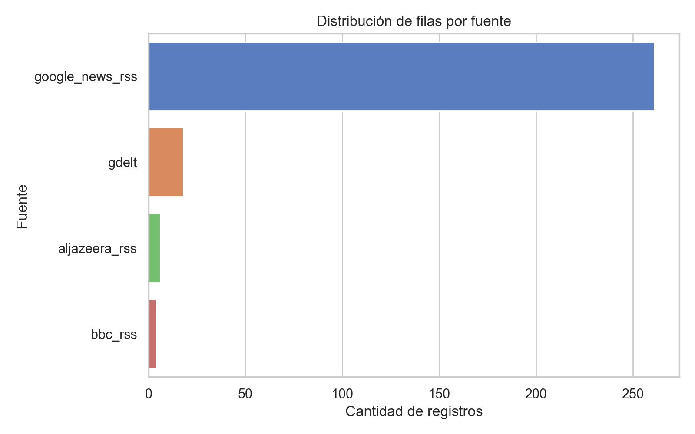
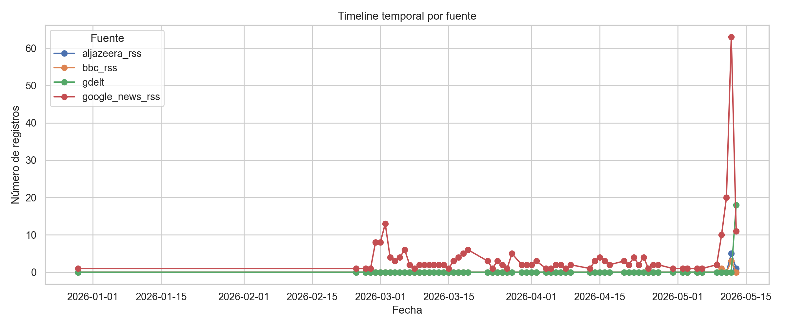
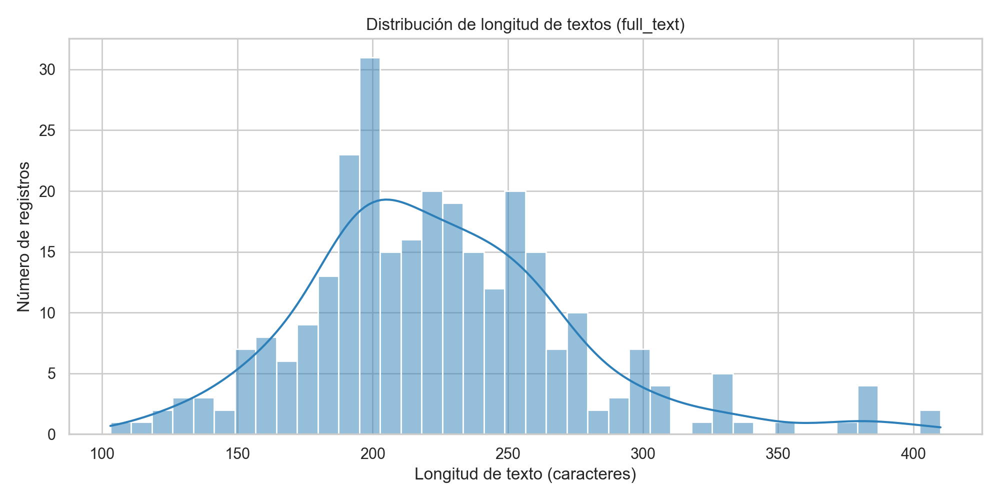
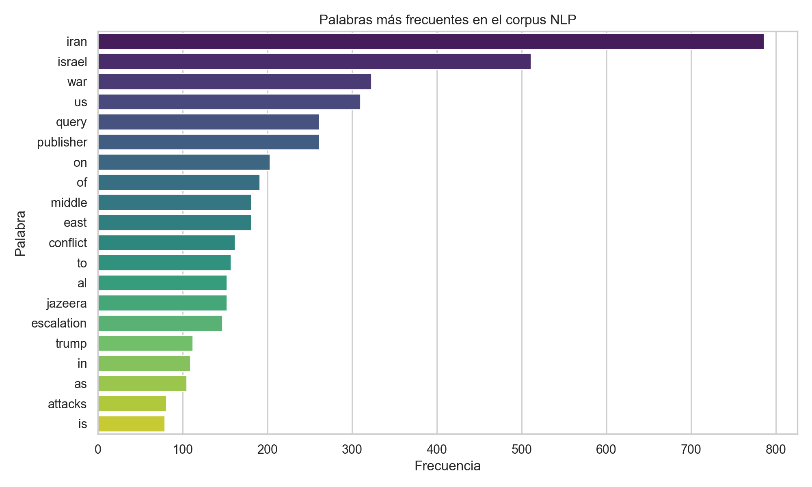
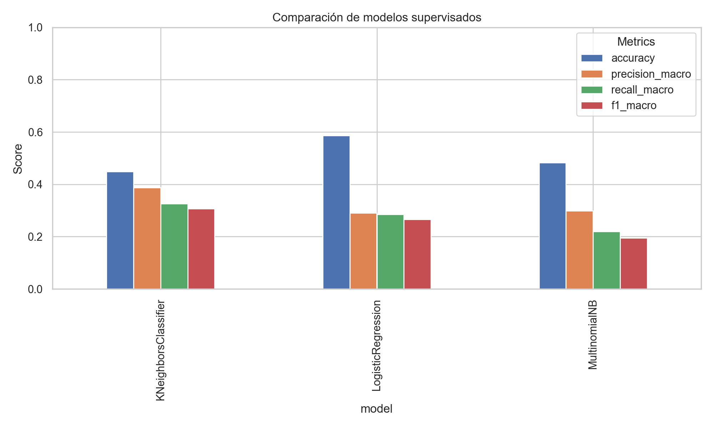

# Informe Final - Proyecto ML1: Análisis OSINT de Conflicto con NLP y ML Supervisado

## 1. Introducción

El presente informe describe un proyecto académico de procesamiento de lenguaje natural (NLP) y aprendizaje supervisado aplicado a fuentes OSINT (Open Source Intelligence) sobre el conflicto Israel-Irán. El objetivo es mostrar un pipeline reproducible que parte de la recolección de noticias RSS, pasa por la construcción de un corpus textual, y culmina en la comparación de modelos supervisados con etiquetas débiles.

El contexto de estudio se ubica en un entorno geopolítico complejo donde el conflicto entre Israel e Irán y sus ramificaciones regionales generan cobertura de noticias, análisis diplomático, sanciones y riesgos de escalada militar. OSINT es una fuente valiosa para analizar este tipo de eventos cuando se trabaja con noticias abiertas y datos públicos.

La motivación central de este proyecto es demostrar una aplicación práctica de NLP en un corpus real de noticias para: i) preparar texto limpio, ii) extraer temas y patrones, iii) crear etiquetas heurísticas débiles, iv) entrenar modelos supervisados y v) evaluar resultados con rigor.

## 2. Objetivos

### 2.1 Objetivo general

- Construir y evaluar un pipeline de NLP y aprendizaje supervisado para clasificar noticias OSINT relacionadas con el conflicto Israel-Irán.

### 2.2 Objetivos específicos

- Integrar y normalizar fuentes textuales disponibles en formato RSS.
- Generar un corpus textual limpio y reproducible.
- Realizar análisis exploratorio de datos (EDA), incluyendo distribuciones por fuente, cronograma y longitud de texto.
- Aplicar técnicas de NLP: tokenización, lematización, TF-IDF, modelado de temas (NMF), clustering y embeddings semánticos.
- Definir y aplicar reglas de weak labeling para categorías de interés.
- Entrenar y comparar modelos supervisados: Logistic Regression, Multinomial Naive Bayes y KNN.
- Evaluar resultados con métricas cuantitativas y documentar limitaciones metodológicas.

## 3. Arquitectura del pipeline

El pipeline del proyecto se divide en las siguientes etapas:

1. **Fuentes**: `bbc_rss.csv`, `aljazeera_rss.csv`, `google_news_rss.csv`, `gdelt.csv`.
2. **Recolección**: lectura de CSV con registros RSS y unificación en un solo dataset.
3. **Limpieza**: normalización de texto, eliminación de HTML, creación de `full_text` y limpieza de stopwords.
4. **NLP**: preprocesamiento, TF-IDF, extracción de temas con NMF, clustering con KMeans, cálculos de embeddings semánticos.
5. **Supervisión**: generación de etiquetas débiles, entrenamiento de modelos, evaluación y comparación.

### Diagrama simplificado del flujo

- Lectura de fuentes → limpieza y normalización → corpus textual.
- Corpus → TF-IDF + NMF + clustering + embeddings.
- Corpus + reglas heurísticas → weak labels.
- Datos etiquetados → modelos supervisados → métricas y visualizaciones.

## 4. Dataset

### 4.1 Descripción de las fuentes

| Fuente | Tipo | Comentario |
|---|---|---|
| `bbc_rss.csv` | Noticias internacionales | Cobertura editorial de BBC News. |
| `aljazeera_rss.csv` | Noticias de Medio Oriente | Cobertura regional con foco geopolítico. |
| `google_news_rss.csv` | Noticias agregadas | Fuente dominante en volumen del corpus. |
| `gdelt.csv` | Eventos estructurados | Registros globales de eventos de conflicto. |

### 4.2 Tamaño del dataset

- Documentos totales procesados: **289**.
- Fuente dominante: `google_news_rss` con **261** registros.
- `gdelt` aporta **18** registros, `aljazeera_rss` aporta **6** y `bbc_rss` aporta **4**.

### 4.3 Sesgos y limitaciones del dataset

- `google_news_rss` es la fuente mayoritaria, lo que introduce un sesgo de estilo editorial y cobertura.
- Las fuentes `aljazeera_rss` y `bbc_rss` están subrepresentadas.
- El tamaño total del corpus es pequeño para tareas multi categoría de NLP.
- Se excluyen de la modelización supervisada `NASA FIRMS` y `OpenSky`, ya que esos datasets no contienen texto periodístico y no forman parte del corpus OSINT textual principal.

## 5. Análisis Exploratorio de Datos (EDA)

### 5.1 Distribución por fuente

La fuente `google_news_rss` domina el corpus, lo cual es relevante para interpretar los modelos y las etiquetas débiles.

### 5.2 Cronograma por fuente

El corpus presenta una concentración temporal notable, lo cual es consistente con ventanas de cobertura intensiva sobre eventos de conflicto.

### 5.3 Distribución de longitud de texto

Las noticias muestran variaciones en la longitud del texto, con documentos cortos y largos que exige un preprocesamiento robusto.

### 5.4 Nube de palabras y términos frecuentes

Los términos más frecuentes confirman el foco en geopolítica, conflicto y actores como Israel, Irán y EUA.

## 6. NLP

### 6.1 Preprocesamiento

El texto se limpió eliminando HTML, URLs, signos de puntuación y normalizando a minúsculas. Se construyó la columna `full_text` que combina título y contenido para maximizar la información disponible.

### 6.2 Tokenización y lematización

Se aplicó tokenización en palabras y lematización para agrupar formas flexionadas. También se eliminaron stopwords en español e inglés para reducir ruido.

### 6.3 TF-IDF

Se calculó una matriz TF-IDF sobre los documentos preprocesados, permitiendo capturar la importancia relativa de términos dentro del corpus.

### 6.4 Modelado de temas con NMF

Se entrenó un modelo NMF para extraer temas latentes. Los temas principales incluyen:

- cobertura de conflicto y escalada (`escalation`)
- retórica diplomática y negociaciones (`diplomacy`)
- acción militar y ataques (`military`)
- cobertura genérica de medios (`other`)

### 6.5 Clustering

Se aplicó KMeans para agrupar documentos en clústeres. La distribución resultante muestra un clúster dominante y varios grupos más pequeños, lo que sugiere patrones temáticos diferenciados.

### 6.6 Embeddings semánticos

El pipeline genera embeddings semánticos para representar los documentos en un espacio vectorial. Estos embeddings permiten visualizar similitudes y apoyar la interpretación de temas y clústeres.

## 7. Weak labeling

### 7.1 Reglas heurísticas

Las etiquetas débiles se derivaron mediante reglas de palabras clave y temas asociados al conflicto. Ejemplos:

- `escalation`: términos como "ataque", "guerra", "escalada".
- `diplomacy`: términos como "negociación", "alto el fuego", "diálogo".
- `military`: términos como "misil", "bombardeo", "militar".
- `humanitarian`: términos como "refugiado", "ayuda humanitaria", "crisis humanitaria".
- `sanctions`: términos como "sanciones", "embargo", "bloqueo".
- `energy`: términos como "petróleo", "energía", "gas".
- `cyber`: términos como "ciberataque", "hackeo", "seguridad cibernética".
- `other`: documentos sin correspondencia fuerte con las reglas anteriores.

### 7.2 Categorías weak labels

| Etiqueta | Documentos |
|---|---:|
| escalation | 109 |
| military | 69 |
| diplomacy | 49 |
| other | 31 |
| energy | 18 |
| humanitarian | 6 |
| sanctions | 5 |
| cyber | 2 |

### 7.3 Limitaciones de las weak labels

- Las etiquetas son heurísticas, no equivalen a ground truth.
- El sesgo de palabras clave puede generar falsos positivos o negativos.
- Las categorías con pocos ejemplos (`cyber`, `sanctions`, `humanitarian`) tienen poca representación.
- El trabajo es válido como prototipo académico, pero requiere revisión humana para validación definitiva.

## 8. Machine Learning

Se entrenaron tres modelos supervisados sobre el corpus etiquetado.

### 8.1 Modelos

- Logistic Regression
- Multinomial Naive Bayes
- K-Nearest Neighbors (KNN)

### 8.2 Métricas

Las métricas de comparación se informaron mediante accuracy, precision macro, recall macro y f1 macro.

### 8.3 Resultados de comparación

| Modelo | Accuracy | Precision macro | Recall macro | F1 macro |
|---|---:|---:|---:|---:|
| Logistic Regression | 0.586207 | 0.290816 | 0.284972 | 0.265635 |
| MultinomialNB | 0.482759 | 0.298413 | 0.219295 | 0.194910 |
| KNeighborsClassifier | 0.448276 | 0.386709 | 0.326314 | 0.307256 |

### 8.4 Evaluación visual

- `confusion_matrix_logreg.png`
- `confusion_matrix_nb.png`
- `confusion_matrix_knn.png`

Estas matrices muestran los patrones de aciertos y errores entre categorías weak-labeled.

## 9. Resultados

### 9.1 Interpretación de métricas

La mejor accuracy se alcanzó con Logistic Regression: **0.586**. Aunque el valor no es alto en términos absolutos, es razonable para un problema multi categoría con:

- corpus pequeño
- etiquetas débiles
- clases desbalanceadas
- lenguaje de noticias reales

La precisión y el recall macro bajos reflejan el efecto del desbalance y la dificultad de las clases minoritarias.

### 9.2 Justificación del accuracy moderado

Un accuracy cercano a 0.58 en este contexto no es sorprendente ni negativo. Los modelos deben discriminar entre múltiples categorías poco representadas y aprender de etiquetas heurísticas ruidosas, por lo que un resultado de este nivel es defendible académicamente.

### 9.3 Desbalance de clases

La distribución de etiquetas muestra una concentración en `escalation`, `military` y `diplomacy`, mientras que las categorías `cyber`, `sanctions` y `humanitarian` tienen representación muy reducida. Esto explica por qué los modelos tienen menos capacidad para generalizar en las clases minoritarias.

## 10. Limitaciones

- **Weak labels**: las etiquetas no son ground truth y dependen de reglas heurísticas.
- **Falta de validación humana**: no se contó con etiquetado manual ni revisión de expertos.
- **Tamaño pequeño**: el corpus de 289 documentos limita la capacidad de aprendizaje.
- **Sesgo de fuentes**: `google_news_rss` domina el dataset y sesga la muestra hacia su estilo.
- **Cobertura temporal**: el corpus concentra eventos en ventanas específicas, por lo que no representa un muestreo continuo.
- **Exclusión de datos no textuales**: `NASA FIRMS` y `OpenSky` no se incorporan al corpus de texto dado que no aportan contenido periodístico directamente utilizable para NLP.

## 11. Trabajo futuro

- Etiquetado humano para validar y corregir las categorías weak.
- Uso de modelos basados en transformers (BERT, XLM-R) para mayor capacidad semántica.
- Construcción de dashboards interactivos para explorar resultados y combinar datos OSINT.
- Integración geoespacial con `NASA FIRMS` y `OpenSky` como capas de contexto situacional.
- Ampliación del corpus con más fuentes y mayor cobertura temporal.
- Técnicas de aumento de datos y refinamiento de weak labels.

## 12. Conclusiones

El proyecto demuestra un pipeline académico completo de NLP y aprendizaje supervisado sobre un corpus OSINT de conflicto Israel-Irán. La combinación de EDA, TF-IDF, NMF, clustering y modelos supervisados genera una base metodológica sólida. Las métricas alcanzadas son coherentes con las limitaciones del corpus y la naturaleza de las etiquetas débiles.

El trabajo es defendible como prueba de concepto para ML1, ya que documenta no solo los resultados, sino también las limitaciones y el razonamiento crítico detrás de la elección de datos y métodos.

## Bibliografía

- Jolliffe, I. T., & Cadima, J. (2016). Principal component analysis: a review and recent developments. *Philosophical Transactions of the Royal Society A: Mathematical, Physical and Engineering Sciences*.
- Deerwester, S., Dumais, S. T., Furnas, G. W., Landauer, T. K., & Harshman, R. (1990). Indexing by latent semantic analysis. *Journal of the American society for information science*, 41(6), 391-407.
- Blei, D. M., Ng, A. Y., & Jordan, M. I. (2003). Latent dirichlet allocation. *Journal of machine Learning research*, 3(Jan), 993-1022.
- Aggarwal, C. C., & Zhai, C. (2012). A survey of text clustering algorithms. *Mining text data*, 77-128.
- Pedregosa, F., Varoquaux, G., Gramfort, A., Michel, V., Thirion, B., Grisel, O., ... & Duchesnay, E. (2011). Scikit-learn: Machine learning in Python. *Journal of machine learning research*, 12, 2825-2830.
- Bird, S., Klein, E., & Loper, E. (2009). *Natural Language Processing with Python*. O'Reilly Media.
- Ryan, J. (2013). *OSINT: The subtle art of intelligence gathering*. Journal of Intelligence and Counterintelligence.

